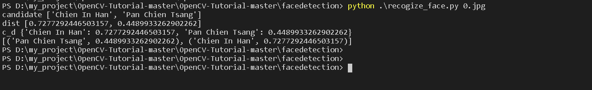

# Face recognition

## face_detection_program_python 的檔案：

-   來源：
-   運作方式：於ppt當中有描寫其運作方式

### 檔案與資料夾說明

1.  detect_face_image.py：
    -   來自官網，未修改，若要辨識新的圖片，需要修改程式中的圖片路徑
    -   功能：框出圖片的人臉，並匯出圖片
2.  detect_face_video.py：
    -   來自官網，未修改，若要辨識新的影片，需要修改程式中的影片路徑
    -   功能：動態框出影片的人臉
3.  detect_face_photo_and_save.py：
    -   修改版，啟動相機並擷取鏡頭中出現之人臉3張存在  `.\face_detection_program_python` 資料夾內
4.  recogize_face.py：
    -   修改版
    -   功能：需手動輸入辨識之圖片路徑，偵測圖片中的人臉特徵，並和res中的圖片做比對，算出最接近值，並顯示出結果
    -   使用方式：

    -   
5.  res資料夾：存放已label的資料

## OpenCV library 下載地址
 - [OpenCV for android](https://sourceforge.net/projects/opencvlibrary/files/3.4.11/opencv-3.4.11-android-sdk.zip/download)
